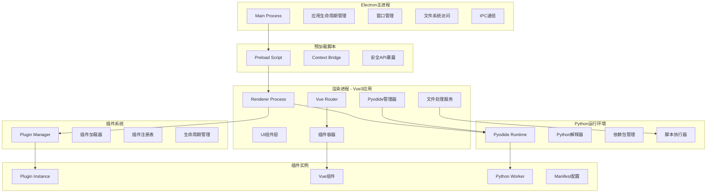
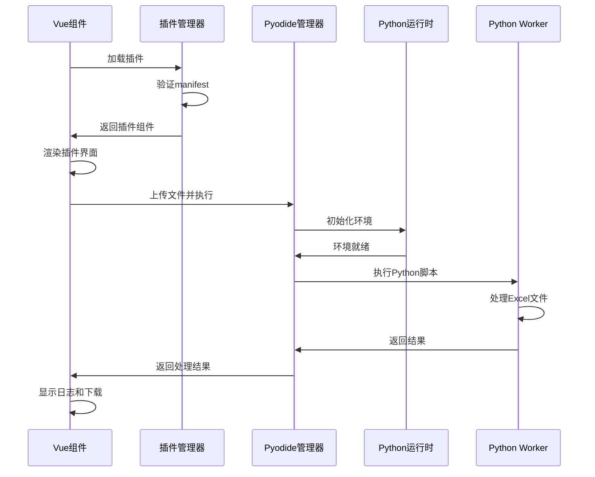

# 设计文档 - Excel工具箱系统

## 概览

Excel工具箱是一个跨平台桌面应用程序，采用Electron作为应用框架，Vue3构建用户界面，Pyodide提供Python运行环境。系统的核心设计理念是**插件化架构**，允许开发者通过创建独立的插件模块来扩展功能，而无需修改核心代码。

### 设计目标

1. **可扩展性**: 通过插件系统实现功能的热插拔，支持第三方开发者贡献插件
2. **跨平台**: 支持Windows、macOS和Linux操作系统
3. **高性能**: 优化大文件处理性能，支持并行处理和流式处理
4. **安全性**: 采用Electron安全最佳实践，Python代码在沙箱环境中运行
5. **易用性**: 提供直观的用户界面和拖拽式文件上传体验

### 技术选型理由

- **Electron 27**: 成熟的跨平台桌面应用框架，提供完整的系统API访问能力
- **Vue3 + Vite**: 现代化的前端技术栈，提供响应式UI和快速的开发体验
- **Pyodide 0.24.1**: 在浏览器中运行Python，无需用户安装Python环境，简化部署
- **Ant Design Vue 4**: 企业级UI组件库，提供丰富的组件和一致的设计语言
- **openpyxl**: Python的Excel处理库，支持读写.xlsx格式文件

## 架构设计

### 系统架构图



### 架构层次

系统采用分层架构，从下到上分为以下层次：

1. **系统层**: Electron主进程，负责应用生命周期、窗口管理和系统API访问
2. **安全层**: 预加载脚本，通过contextBridge提供安全的API桥接
3. **应用层**: Vue3渲染进程，包含UI组件、路由和业务逻辑
4. **插件层**: 插件管理器和插件实例，提供可扩展的功能模块
5. **运行时层**: Pyodide环境，执行Python脚本处理Excel文件

### 进程通信模型



## 组件和接口

### 核心组件

#### 1. 主进程 (Main Process)

**职责**: 
- 管理应用程序生命周期
- 创建和管理BrowserWindow
- 处理系统级事件和API调用
- 提供文件系统访问能力

**关键接口**:
```typescript
interface MainProcess {
  // 应用初始化
  initialize(): Promise<void>;
  
  // 创建主窗口
  createMainWindow(): BrowserWindow;
  
  // 处理IPC消息
  handleIPC(channel: string, handler: Function): void;
  
  // 应用退出清理
  cleanup(): Promise<void>;
}
```


#### 2. 预加载脚本 (Preload Script)

**职责**:
- 在渲染进程和主进程之间建立安全的通信桥梁
- 暴露受限的API给渲染进程
- 确保安全隔离

**关键接口**:
```typescript
interface PreloadAPI {
  // 文件系统操作
  fs: {
    readFile(path: string): Promise<Buffer>;
    writeFile(path: string, data: Buffer): Promise<void>;
    selectFile(): Promise<string>;
  };
  
  // 应用信息
  app: {
    getVersion(): string;
    getPlatform(): string;
  };
}
```

#### 3. 插件管理器 (Plugin Manager)

**职责**:
- 扫描和加载插件
- 验证插件配置
- 管理插件生命周期
- 提供插件注册和卸载功能

**关键接口**:
```typescript
interface PluginManager {
  // 加载所有插件
  loadPlugins(): Promise<Plugin[]>;
  
  // 注册单个插件
  registerPlugin(plugin: Plugin): void;
  
  // 卸载插件
  unregisterPlugin(pluginKey: string): void;
  
  // 获取插件列表
  getPlugins(): Plugin[];
  
  // 获取单个插件
  getPlugin(pluginKey: string): Plugin | null;
}

interface Plugin {
  key: string;
  name: string;
  icon: string;
  description: string;
  author?: string;
  version?: string;
  dependencies?: string[];
  component: Component;
  worker: string;
}
```

#### 4. Pyodide管理器 (Pyodide Manager)

**职责**:
- 加载和初始化Pyodide环境
- 管理Python依赖包
- 执行Python脚本
- 处理执行结果和错误

**关键接口**:
```typescript
interface PyodideManager {
  // 初始化Pyodide
  initialize(config: PyodideConfig): Promise<void>;
  
  // 安装Python包
  installPackage(packageName: string, version?: string): Promise<void>;
  
  // 执行Python脚本
  runPython(script: string, input: RunPyInput, options?: RunPyOptions): Promise<RunPyOutput>;
  
  // 检查环境状态
  isReady(): boolean;
}

interface PyodideConfig {
  version: string;
  loadMode: 'cdn' | 'local';
  localIndexURL?: string;
  cdnIndexURL?: string;
  fallbackMode?: 'local' | 'cdn';
  retryAttempts?: number;
  timeout?: number;
}

interface RunPyInput {
  file: ArrayBuffer;
  fileName: string;
  params?: Record<string, any>;
}

interface RunPyOutput {
  success: boolean;
  buffer?: ArrayBuffer;
  logs: string[];
  details?: any;
  error?: string;
}
```


#### 5. 文件处理服务 (File Processing Service)

**职责**:
- 处理文件上传和验证
- 协调Python脚本执行
- 管理处理结果
- 提供文件下载功能

**关键接口**:
```typescript
interface FileProcessingService {
  // 验证文件
  validateFile(file: File): ValidationResult;
  
  // 处理单个文件
  processFile(file: File, worker: string, params?: any): Promise<ProcessResult>;
  
  // 批量处理文件
  processBatch(files: File[], worker: string, params?: any): Promise<ProcessResult[]>;
  
  // 下载处理结果
  downloadResult(result: ProcessResult, fileName: string): void;
}

interface ValidationResult {
  valid: boolean;
  error?: string;
}

interface ProcessResult {
  success: boolean;
  fileName: string;
  buffer?: ArrayBuffer;
  logs: string[];
  statistics?: Record<string, any>;
  error?: string;
}
```

#### 6. 路由管理器 (Router Manager)

**职责**:
- 管理应用路由
- 动态注册插件路由
- 处理导航

**关键接口**:
```typescript
interface RouterManager {
  // 注册插件路由
  registerPluginRoute(plugin: Plugin): void;
  
  // 导航到插件
  navigateToPlugin(pluginKey: string): void;
  
  // 获取当前路由
  getCurrentRoute(): string;
}
```

### 插件接口规范

#### Manifest配置

每个插件必须包含`manifest.json`文件，定义插件元数据：

```json
{
  "key": "plugin-unique-key",
  "name": "插件显示名称",
  "icon": "icon-name",
  "description": "插件功能描述",
  "author": "作者名称",
  "version": "1.0.0",
  "dependencies": ["openpyxl", "pillow"]
}
```

#### Vue组件接口

插件的Vue组件应遵循以下结构：

```vue
<template>
  <div class="plugin-container">
    <!-- 插件UI -->
  </div>
</template>

<script setup lang="ts">
import { ref, onMounted, onUnmounted } from 'vue';
import { runPy } from '@/utils/py';

// 插件状态
const files = ref<File[]>([]);
const processing = ref(false);
const logs = ref<string[]>([]);

// 生命周期钩子
onMounted(() => {
  // 插件初始化
});

onUnmounted(() => {
  // 清理资源
});

// 文件处理
async function handleProcess() {
  processing.value = true;
  try {
    const result = await runPy(workerScript, {
      file: await files.value[0].arrayBuffer(),
      fileName: files.value[0].name
    });
    logs.value = result.logs;
    // 处理结果
  } catch (error) {
    // 错误处理
  } finally {
    processing.value = false;
  }
}
</script>
```


#### Python Worker接口

插件的Python脚本应实现`process`函数：

```python
import io
import openpyxl

def process(data):
    """
    处理Excel文件
    
    参数:
        data: dict - 包含file、fileName和params的字典
        
    返回:
        dict - 包含success、buffer、logs、details和error的字典
    """
    file_content = data['file']
    file_name = data['fileName']
    params = data.get('params', {})
    logs = []
    
    try:
        # 加载Excel文件
        wb = openpyxl.load_workbook(io.BytesIO(file_content), read_only=False)
        logs.append(f"成功加载文件: {file_name}")
        
        # 处理逻辑
        # ...
        
        # 保存结果
        output = io.BytesIO()
        wb.save(output)
        output.seek(0)
        
        return {
            'success': True,
            'buffer': output.read(),
            'logs': logs,
            'details': {
                # 统计信息
            }
        }
    except Exception as e:
        logs.append(f"错误: {str(e)}")
        return {
            'success': False,
            'error': str(e),
            'logs': logs
        }
```

## 数据模型

### 插件数据模型

```typescript
// 插件元数据
interface PluginMetadata {
  key: string;              // 唯一标识
  name: string;             // 显示名称
  icon: string;             // 图标名称
  description: string;      // 功能描述
  author?: string;          // 作者
  version?: string;         // 版本号
  dependencies?: string[];  // Python依赖
}

// 插件实例
interface PluginInstance {
  metadata: PluginMetadata;
  component: Component;     // Vue组件
  worker: string;           // Python脚本内容
  route: RouteConfig;       // 路由配置
  state: PluginState;       // 插件状态
}

// 插件状态
enum PluginState {
  UNLOADED = 'unloaded',
  LOADING = 'loading',
  LOADED = 'loaded',
  ERROR = 'error'
}
```

### 文件处理数据模型

```typescript
// 文件信息
interface FileInfo {
  name: string;
  size: number;
  type: string;
  lastModified: number;
  buffer: ArrayBuffer;
}

// 处理任务
interface ProcessingTask {
  id: string;
  file: FileInfo;
  plugin: string;
  status: TaskStatus;
  progress: number;
  startTime: number;
  endTime?: number;
  result?: ProcessResult;
}

// 任务状态
enum TaskStatus {
  PENDING = 'pending',
  PROCESSING = 'processing',
  COMPLETED = 'completed',
  FAILED = 'failed'
}

// 处理结果
interface ProcessResult {
  success: boolean;
  fileName: string;
  buffer?: ArrayBuffer;
  logs: string[];
  statistics?: Statistics;
  error?: string;
}

// 统计信息
interface Statistics {
  [key: string]: number | string;
}
```


### Pyodide配置数据模型

```typescript
// Pyodide配置
interface PyodideConfiguration {
  version: string;
  loadMode: LoadMode;
  localIndexURL?: string;
  cdnIndexURL?: string;
  fallbackMode?: LoadMode;
  retryAttempts: number;
  timeout: number;
}

enum LoadMode {
  CDN = 'cdn',
  LOCAL = 'local'
}

// Python包信息
interface PythonPackage {
  name: string;
  version?: string;
  installed: boolean;
}

// 执行选项
interface ExecutionOptions {
  timeout?: number;
  onProgress?: (progress: number) => void;
  onLog?: (log: string) => void;
}
```

### 应用状态数据模型

```typescript
// 应用全局状态
interface AppState {
  initialized: boolean;
  pyodideReady: boolean;
  plugins: PluginInstance[];
  currentPlugin?: string;
  processingTasks: ProcessingTask[];
  history: ProcessingHistory[];
}

// 处理历史
interface ProcessingHistory {
  id: string;
  timestamp: number;
  plugin: string;
  fileName: string;
  success: boolean;
  duration: number;
}
```

## 正确性属性

*属性是一个特征或行为，应该在系统的所有有效执行中保持为真——本质上是关于系统应该做什么的形式化陈述。属性作为人类可读规范和机器可验证正确性保证之间的桥梁。*

### 属性 1: 插件加载幂等性

*对于任何*插件，多次加载同一个插件应该产生相同的插件实例，不会创建重复的注册。

**验证需求**: 需求 3.1, 3.4

### 属性 2: 文件类型验证一致性

*对于任何*上传的文件，如果文件扩展名为.xlsx或.xls，则系统应该接受该文件；否则应该拒绝并返回错误。

**验证需求**: 需求 4.1, 4.2

### 属性 3: Python脚本执行隔离性

*对于任何*两个并发的Python脚本执行，一个脚本的执行不应该影响另一个脚本的执行结果或状态。

**验证需求**: 需求 5.1, 5.2

### 属性 4: 处理结果完整性

*对于任何*成功的文件处理，返回的结果必须包含buffer和logs字段，且buffer不为空。

**验证需求**: 需求 6.1, 6.2

### 属性 5: 错误传播正确性

*对于任何*Python脚本执行错误，系统应该捕获异常并在结果中返回error字段，而不是导致应用崩溃。

**验证需求**: 需求 5.5, 14.1, 14.4

### 属性 6: 插件依赖安装顺序性

*对于任何*插件的依赖列表，系统应该在加载插件之前按顺序安装所有依赖，如果任何依赖安装失败，则插件加载应该失败。

**验证需求**: 需求 19.1, 19.2

### 属性 7: 文件格式保留性

*对于任何*Excel文件处理操作（除了格式转换），处理后的文件应该保持原始文件的格式类型（.xlsx保持.xlsx，.xls保持.xls）。

**验证需求**: 需求 20.3, 7.4, 10.4

### 属性 8: 空白行识别准确性

*对于任何*Excel工作表，一行被识别为空白行当且仅当该行的所有单元格都不包含任何值（包括空字符串、空格、公式等）。

**验证需求**: 需求 7.1

### 属性 9: 删除操作原子性

*对于任何*删除操作（删除空白行、删除公式、删除图片等），要么所有目标对象都被删除，要么在发生错误时保持原始状态不变。

**验证需求**: 需求 7.2, 10.2, 23.2


### 属性 10: 重复行判断一致性

*对于任何*两行数据和指定的比较列集合，如果两行在所有指定列上的值都相等，则这两行应该被判定为重复；否则不应该被判定为重复。

**验证需求**: 需求 11.2

### 属性 11: 合并操作顺序保持性

*对于任何*多个Excel文件的合并操作，合并后的数据应该按照输入文件的顺序排列，每个文件内部的行顺序保持不变。

**验证需求**: 需求 12.3

### 属性 12: 规则应用顺序性

*对于任何*多条替换规则的应用，规则应该按照定义的顺序依次应用，后面的规则应该作用于前面规则处理后的结果。

**验证需求**: 需求 9.2

### 属性 13: 正则表达式替换正确性

*对于任何*正则表达式替换规则，所有匹配该正则表达式的文本都应该被替换，且替换次数应该等于匹配次数。

**验证需求**: 需求 9.1, 9.4

### 属性 14: 图片URL有效性验证

*对于任何*图片URL，系统应该验证URL格式的有效性（HTTP/HTTPS/文件路径），只有格式有效的URL才会尝试下载。

**验证需求**: 需求 24.1, 24.4

### 属性 15: 水印应用一致性

*对于任何*工作表或图片集合，应用水印后，所有目标对象都应该包含相同配置的水印。

**验证需求**: 需求 29.4, 30.2

### 属性 16: 拆分文件完整性

*对于任何*文件拆分操作，所有拆分后的文件合并起来应该包含原始文件的所有数据，且数据顺序保持一致。

**验证需求**: 需求 32.3, 33.2

### 属性 17: 元数据操作独立性

*对于任何*元数据修改操作，修改元数据不应该影响文件的内容数据和格式。

**验证需求**: 需求 39.3, 40.3

### 属性 18: 保护密码验证正确性

*对于任何*受密码保护的Excel文件，只有提供正确的密码才能删除保护，错误的密码应该被拒绝。

**验证需求**: 需求 41.3, 41.4

### 属性 19: 文件优化可逆性

*对于任何*Excel文件优化操作，优化后的文件应该能够被Excel正常打开，且所有可见内容和数据保持不变。

**验证需求**: 需求 42.5

### 属性 20: Pyodide环境单例性

*对于任何*应用实例，Pyodide环境应该只被初始化一次，后续的访问应该返回同一个环境实例。

**验证需求**: 需求 2.1, 2.5

### 属性 21: 插件路由唯一性

*对于任何*两个不同的插件，它们的路由路径应该是唯一的，不应该存在路由冲突。

**验证需求**: 需求 3.1, 13.2

### 属性 22: 批量处理独立性

*对于任何*批量文件处理，每个文件的处理应该是独立的，一个文件处理失败不应该影响其他文件的处理。

**验证需求**: 需求 4.4, 14.4

### 属性 23: 日志时序性

*对于任何*处理过程，日志记录应该按照事件发生的时间顺序排列，后发生的事件不应该出现在先发生的事件之前。

**验证需求**: 需求 6.1, 14.2

### 属性 24: 超时保护有效性

*对于任何*Python脚本执行，如果执行时间超过配置的超时时间，系统应该终止执行并返回超时错误。

**验证需求**: 需求 5.4

### 属性 25: 配置回退正确性

*对于任何*Pyodide加载失败的情况，如果配置了回退模式，系统应该尝试使用回退源加载，最多重试配置的次数。

**验证需求**: 需求 2.2, 18.3


## 错误处理

### 错误分类

系统中的错误分为以下几类：

1. **用户输入错误**: 无效的文件格式、空文件、文件过大等
2. **环境错误**: Pyodide加载失败、依赖安装失败、网络错误等
3. **处理错误**: Python脚本执行错误、Excel文件损坏、内存不足等
4. **系统错误**: 应用崩溃、文件系统错误、权限错误等

### 错误处理策略

#### 1. 用户输入错误

**策略**: 在UI层进行验证，提供即时反馈

```typescript
function validateFile(file: File): ValidationResult {
  // 检查文件类型
  if (!file.name.endsWith('.xlsx') && !file.name.endsWith('.xls')) {
    return {
      valid: false,
      error: '不支持的文件格式，请上传.xlsx或.xls文件'
    };
  }
  
  // 检查文件大小
  if (file.size > 100 * 1024 * 1024) {
    return {
      valid: false,
      error: '文件过大，建议处理小于100MB的文件'
    };
  }
  
  return { valid: true };
}
```

#### 2. 环境错误

**策略**: 实现重试机制和回退方案

```typescript
async function loadPyodideWithRetry(config: PyodideConfig): Promise<any> {
  let lastError: Error;
  
  for (let i = 0; i < config.retryAttempts; i++) {
    try {
      // 尝试从主源加载
      return await loadPyodide({
        indexURL: config.loadMode === 'cdn' 
          ? config.cdnIndexURL 
          : config.localIndexURL
      });
    } catch (error) {
      lastError = error;
      
      // 如果配置了回退模式，尝试回退源
      if (config.fallbackMode && i === 0) {
        config.loadMode = config.fallbackMode;
      }
    }
  }
  
  throw new Error(`Pyodide加载失败: ${lastError.message}`);
}
```

#### 3. 处理错误

**策略**: 捕获Python异常，记录详细日志，不影响应用稳定性

```python
def process(data):
    logs = []
    try:
        # 处理逻辑
        result = process_excel(data)
        return {
            'success': True,
            'buffer': result,
            'logs': logs
        }
    except openpyxl.utils.exceptions.InvalidFileException as e:
        logs.append(f"文件格式错误: {str(e)}")
        return {
            'success': False,
            'error': '文件可能已损坏或格式不正确',
            'logs': logs
        }
    except MemoryError as e:
        logs.append(f"内存不足: {str(e)}")
        return {
            'success': False,
            'error': '文件过大，内存不足',
            'logs': logs
        }
    except Exception as e:
        logs.append(f"未知错误: {str(e)}")
        return {
            'success': False,
            'error': str(e),
            'logs': logs
        }
```

#### 4. 系统错误

**策略**: 全局错误处理器，记录错误日志，优雅降级

```typescript
// Vue全局错误处理
app.config.errorHandler = (err, instance, info) => {
  console.error('Vue错误:', err, info);
  logError({
    type: 'vue',
    error: err,
    component: instance?.$options.name,
    info
  });
  
  // 显示用户友好的错误消息
  message.error('应用发生错误，请刷新页面重试');
};

// 未捕获的Promise错误
window.addEventListener('unhandledrejection', (event) => {
  console.error('未处理的Promise错误:', event.reason);
  logError({
    type: 'promise',
    error: event.reason
  });
});
```

### 错误日志

所有错误都应该记录到日志文件，包含以下信息：

```typescript
interface ErrorLog {
  timestamp: number;
  type: 'user' | 'environment' | 'processing' | 'system';
  level: 'warning' | 'error' | 'critical';
  message: string;
  stack?: string;
  context?: Record<string, any>;
}
```

日志文件位置：
- Windows: `%APPDATA%/excel-toolbox/logs/`
- macOS: `~/Library/Application Support/excel-toolbox/logs/`
- Linux: `~/.config/excel-toolbox/logs/`


## 测试策略

### 测试方法

系统采用**双重测试方法**：单元测试和基于属性的测试（Property-Based Testing, PBT）相结合。

- **单元测试**: 验证特定示例、边界情况和错误条件
- **属性测试**: 验证通用属性在所有输入下都成立
- 两者互补，共同提供全面的测试覆盖

### 测试框架

- **单元测试**: Vitest（Vue/TypeScript代码）
- **属性测试**: fast-check（JavaScript/TypeScript的PBT库）
- **Python测试**: pytest + hypothesis（Python代码的PBT库）
- **E2E测试**: Playwright（端到端测试）

### 属性测试配置

每个属性测试应该：
- 运行至少100次迭代（由于随机化）
- 使用注释标记引用设计文档中的属性
- 标记格式: `// Feature: excel-toolbox-system, Property {number}: {property_text}`

### 测试覆盖范围

#### 1. 核心组件测试

**插件管理器测试**:
```typescript
// 单元测试示例
describe('PluginManager', () => {
  it('should load valid plugin', async () => {
    const plugin = createMockPlugin();
    const manager = new PluginManager();
    await manager.registerPlugin(plugin);
    expect(manager.getPlugin(plugin.key)).toBe(plugin);
  });
  
  it('should reject invalid manifest', async () => {
    const invalidPlugin = { key: '', name: '' };
    const manager = new PluginManager();
    await expect(manager.registerPlugin(invalidPlugin))
      .rejects.toThrow('Invalid manifest');
  });
});

// 属性测试示例
// Feature: excel-toolbox-system, Property 1: 插件加载幂等性
describe('PluginManager Properties', () => {
  it('should be idempotent when loading same plugin multiple times', () => {
    fc.assert(
      fc.asyncProperty(
        fc.record({
          key: fc.string(),
          name: fc.string(),
          icon: fc.string(),
          description: fc.string()
        }),
        async (pluginData) => {
          const manager = new PluginManager();
          const plugin = createPlugin(pluginData);
          
          await manager.registerPlugin(plugin);
          await manager.registerPlugin(plugin);
          await manager.registerPlugin(plugin);
          
          const plugins = manager.getPlugins();
          const count = plugins.filter(p => p.key === plugin.key).length;
          
          expect(count).toBe(1);
        }
      ),
      { numRuns: 100 }
    );
  });
});
```

**文件验证测试**:
```typescript
// Feature: excel-toolbox-system, Property 2: 文件类型验证一致性
describe('File Validation Properties', () => {
  it('should accept xlsx and xls files, reject others', () => {
    fc.assert(
      fc.property(
        fc.string(),
        fc.oneof(
          fc.constant('.xlsx'),
          fc.constant('.xls'),
          fc.string().filter(s => s !== '.xlsx' && s !== '.xls')
        ),
        (baseName, extension) => {
          const fileName = baseName + extension;
          const file = new File([], fileName);
          const result = validateFile(file);
          
          if (extension === '.xlsx' || extension === '.xls') {
            expect(result.valid).toBe(true);
          } else {
            expect(result.valid).toBe(false);
          }
        }
      ),
      { numRuns: 100 }
    );
  });
});
```

#### 2. Python脚本测试

**删除空白行测试**:
```python
# 单元测试
def test_remove_empty_rows_basic():
    wb = openpyxl.Workbook()
    ws = wb.active
    ws['A1'] = 'Data'
    ws['A3'] = 'Data'
    # A2是空白行
    
    result = remove_empty_rows(wb)
    
    assert result['success'] == True
    assert result['details']['deletedRows'] == 1

# 属性测试
# Feature: excel-toolbox-system, Property 8: 空白行识别准确性
@given(st.lists(st.lists(st.one_of(st.none(), st.text(), st.integers()))))
def test_empty_row_identification(rows):
    wb = openpyxl.Workbook()
    ws = wb.active
    
    # 填充数据
    for i, row in enumerate(rows, 1):
        for j, value in enumerate(row, 1):
            if value is not None:
                ws.cell(i, j, value)
    
    result = remove_empty_rows(wb)
    
    # 验证：空白行应该被删除
    expected_empty = sum(1 for row in rows if all(v is None for v in row))
    assert result['details']['deletedRows'] == expected_empty
```

#### 3. 集成测试

测试完整的文件处理流程：

```typescript
describe('File Processing Integration', () => {
  it('should process file end-to-end', async () => {
    // 准备测试文件
    const file = await loadTestFile('test.xlsx');
    
    // 加载插件
    const plugin = await loadPlugin('remove-empty-row');
    
    // 执行处理
    const result = await processFile(file, plugin.worker);
    
    // 验证结果
    expect(result.success).toBe(true);
    expect(result.buffer).toBeDefined();
    expect(result.logs.length).toBeGreaterThan(0);
  });
});
```

#### 4. 性能测试

测试大文件处理性能：

```typescript
describe('Performance Tests', () => {
  it('should process 10MB file within 5 seconds', async () => {
    const file = await generateLargeFile(10 * 1024 * 1024);
    
    const startTime = Date.now();
    const result = await processFile(file, 'remove-empty-row');
    const duration = Date.now() - startTime;
    
    expect(duration).toBeLessThan(5000);
    expect(result.success).toBe(true);
  });
});
```

### 测试数据生成

使用fast-check和hypothesis生成测试数据：

```typescript
// 生成随机Excel文件结构
const excelDataArbitrary = fc.record({
  sheets: fc.array(fc.record({
    name: fc.string(),
    rows: fc.array(fc.array(fc.oneof(
      fc.string(),
      fc.integer(),
      fc.double(),
      fc.constant(null)
    )))
  }))
});

// 生成随机插件配置
const pluginManifestArbitrary = fc.record({
  key: fc.string().filter(s => s.length > 0),
  name: fc.string(),
  icon: fc.string(),
  description: fc.string(),
  dependencies: fc.array(fc.string())
});
```

### 持续集成

测试应该在以下情况下自动运行：
- 每次代码提交
- Pull Request创建时
- 定期（每日）回归测试

CI配置应该包括：
- 单元测试（快速反馈）
- 属性测试（全面覆盖）
- 集成测试（端到端验证）
- 性能测试（性能回归检测）

### 测试覆盖率目标

- 核心组件代码覆盖率: ≥ 90%
- 插件接口代码覆盖率: ≥ 80%
- 关键路径代码覆盖率: 100%


## 安全设计

### Electron安全最佳实践

系统严格遵循Electron安全指南：

#### 1. 上下文隔离

```javascript
// packages/main/index.js
const mainWindow = new BrowserWindow({
  webPreferences: {
    contextIsolation: true,        // 启用上下文隔离
    nodeIntegration: false,        // 禁用Node集成
    sandbox: true,                 // 启用沙箱
    preload: path.join(__dirname, '../preload/index.js')
  }
});
```

#### 2. 安全的IPC通信

```javascript
// packages/preload/index.js
const { contextBridge, ipcRenderer } = require('electron');

contextBridge.exposeInMainWorld('electronAPI', {
  // 只暴露必要的API
  selectFile: () => ipcRenderer.invoke('select-file'),
  saveFile: (data) => ipcRenderer.invoke('save-file', data),
  // 不暴露完整的ipcRenderer
});
```

#### 3. 内容安全策略 (CSP)

```html
<meta http-equiv="Content-Security-Policy" 
      content="default-src 'self'; 
               script-src 'self' 'unsafe-eval'; 
               style-src 'self' 'unsafe-inline'; 
               img-src 'self' data: https:; 
               connect-src 'self' https://cdn.jsdelivr.net;">
```

### Python沙箱安全

Pyodide在WebAssembly沙箱中运行，提供以下安全保障：

1. **文件系统隔离**: Python代码无法访问真实的文件系统
2. **网络限制**: 网络请求受浏览器同源策略限制
3. **内存隔离**: Python运行时与主应用内存隔离

### 数据安全

#### 1. 本地数据处理

- 所有文件处理在本地完成，不上传到服务器
- 用户数据不离开用户设备

#### 2. 敏感信息保护

```typescript
// 清除敏感信息
function sanitizeLog(log: string): string {
  // 移除可能的文件路径
  return log.replace(/[A-Z]:\\[\w\\]+/g, '[PATH]')
            .replace(/\/[\w\/]+/g, '[PATH]');
}

// 清除元数据
function clearMetadata(workbook: Workbook): void {
  workbook.properties.creator = '';
  workbook.properties.lastModifiedBy = '';
  workbook.properties.company = '';
}
```

#### 3. 密码处理

```typescript
// 密码不应该被记录或存储
function verifyPassword(file: File, password: string): boolean {
  try {
    // 验证密码
    const result = unlockFile(file, password);
    // 不记录密码
    return result.success;
  } catch (error) {
    // 错误信息中不包含密码
    throw new Error('密码验证失败');
  }
}
```

### 依赖安全

#### 1. 依赖审计

定期审计npm和Python依赖的安全漏洞：

```bash
# npm审计
npm audit

# Python依赖检查
pip-audit
```

#### 2. 依赖锁定

使用package-lock.json和requirements.txt锁定依赖版本，防止供应链攻击。

#### 3. 最小权限原则

只安装必要的依赖，避免引入不必要的安全风险。

## 性能优化

### 1. Pyodide加载优化

#### CDN加速

```typescript
const config: PyodideConfig = {
  version: '0.24.1',
  loadMode: 'cdn',
  cdnIndexURL: 'https://cdn.jsdelivr.net/pyodide/v0.24.1/full/',
  fallbackMode: 'local',
  timeout: 30000
};
```

#### 预加载常用包

```typescript
async function preloadCommonPackages() {
  const commonPackages = ['openpyxl', 'pillow', 'pandas'];
  
  await Promise.all(
    commonPackages.map(pkg => pyodide.loadPackage(pkg))
  );
}
```

#### 懒加载

```typescript
// 只在需要时加载Pyodide
let pyodideInstance: any = null;

async function getPyodide() {
  if (!pyodideInstance) {
    pyodideInstance = await loadPyodide(config);
    await preloadCommonPackages();
  }
  return pyodideInstance;
}
```

### 2. 文件处理优化

#### 流式处理

对于大文件，使用流式处理减少内存占用：

```typescript
async function processLargeFile(file: File): Promise<ProcessResult> {
  const chunkSize = 1024 * 1024; // 1MB chunks
  const chunks: ArrayBuffer[] = [];
  
  for (let offset = 0; offset < file.size; offset += chunkSize) {
    const chunk = await file.slice(offset, offset + chunkSize).arrayBuffer();
    chunks.push(chunk);
  }
  
  // 处理chunks
  return processChunks(chunks);
}
```

#### 并行处理

```typescript
async function processBatch(files: File[]): Promise<ProcessResult[]> {
  // 限制并发数量，避免内存溢出
  const concurrency = 3;
  const results: ProcessResult[] = [];
  
  for (let i = 0; i < files.length; i += concurrency) {
    const batch = files.slice(i, i + concurrency);
    const batchResults = await Promise.all(
      batch.map(file => processFile(file))
    );
    results.push(...batchResults);
  }
  
  return results;
}
```

#### Web Worker

将耗时操作移到Web Worker：

```typescript
// worker.ts
self.onmessage = async (e) => {
  const { file, script } = e.data;
  const result = await runPython(script, file);
  self.postMessage(result);
};

// main.ts
const worker = new Worker('worker.ts');
worker.postMessage({ file, script });
worker.onmessage = (e) => {
  const result = e.data;
  // 处理结果
};
```

### 3. UI性能优化

#### 虚拟滚动

对于大量数据的列表，使用虚拟滚动：

```vue
<template>
  <VirtualList
    :items="files"
    :item-height="60"
    :visible-count="10"
  >
    <template #item="{ item }">
      <FileItem :file="item" />
    </template>
  </VirtualList>
</template>
```

#### 组件懒加载

```typescript
// 路由懒加载
const routes = [
  {
    path: '/plugin/:key',
    component: () => import('@/views/PluginView.vue')
  }
];

// 组件懒加载
const PluginComponent = defineAsyncComponent(() =>
  import(`@/plugins/${pluginKey}/index.vue`)
);
```

#### 防抖和节流

```typescript
// 防抖：搜索输入
const debouncedSearch = debounce((query: string) => {
  performSearch(query);
}, 300);

// 节流：滚动事件
const throttledScroll = throttle(() => {
  updateScrollPosition();
}, 100);
```

### 4. 内存管理

#### 及时释放资源

```typescript
function processFile(file: File): Promise<ProcessResult> {
  let buffer: ArrayBuffer | null = null;
  
  try {
    buffer = await file.arrayBuffer();
    const result = await process(buffer);
    return result;
  } finally {
    // 释放内存
    buffer = null;
  }
}
```

#### 监控内存使用

```typescript
function checkMemoryUsage() {
  if (performance.memory) {
    const used = performance.memory.usedJSHeapSize;
    const limit = performance.memory.jsHeapSizeLimit;
    const usage = (used / limit) * 100;
    
    if (usage > 80) {
      console.warn('内存使用率过高:', usage.toFixed(2) + '%');
      // 触发垃圾回收或清理缓存
    }
  }
}
```

### 5. 构建优化

#### 代码分割

```typescript
// vite.config.ts
export default defineConfig({
  build: {
    rollupOptions: {
      output: {
        manualChunks: {
          'vendor': ['vue', 'vue-router', 'ant-design-vue'],
          'pyodide': ['pyodide'],
        }
      }
    }
  }
});
```

#### 资源压缩

```typescript
// vite.config.ts
export default defineConfig({
  build: {
    minify: 'terser',
    terserOptions: {
      compress: {
        drop_console: true,
        drop_debugger: true
      }
    }
  }
});
```

## 部署和分发

### 构建配置

使用electron-builder进行多平台打包：

```json
{
  "build": {
    "appId": "com.excelbox.app",
    "productName": "Excel工具箱",
    "directories": {
      "output": "dist"
    },
    "files": [
      "packages/main/**/*",
      "packages/preload/**/*",
      "packages/renderer/dist/**/*",
      "plugins/**/*"
    ],
    "win": {
      "target": ["nsis", "portable"],
      "icon": "build/icon.ico"
    },
    "mac": {
      "target": ["dmg", "zip"],
      "icon": "build/icon.icns",
      "category": "public.app-category.productivity"
    },
    "linux": {
      "target": ["AppImage", "deb"],
      "icon": "build/icon.png",
      "category": "Office"
    }
  }
}
```

### 自动更新

集成electron-updater实现自动更新：

```typescript
import { autoUpdater } from 'electron-updater';

autoUpdater.checkForUpdatesAndNotify();

autoUpdater.on('update-available', () => {
  // 通知用户有新版本
});

autoUpdater.on('update-downloaded', () => {
  // 提示用户重启应用
});
```

### 发布流程

1. 版本号更新（遵循语义化版本）
2. 构建所有平台的安装包
3. 生成更新清单
4. 上传到发布服务器
5. 通知用户更新

## 扩展性设计

### 插件市场

未来可以实现插件市场，允许用户浏览和安装社区插件：

```typescript
interface PluginMarket {
  // 搜索插件
  searchPlugins(query: string): Promise<PluginInfo[]>;
  
  // 安装插件
  installPlugin(pluginId: string): Promise<void>;
  
  // 更新插件
  updatePlugin(pluginId: string): Promise<void>;
  
  // 卸载插件
  uninstallPlugin(pluginId: string): Promise<void>;
}
```

### 本地Python环境支持

支持使用本地Python环境替代Pyodide，提供更好的性能：

```typescript
interface PythonRuntime {
  type: 'pyodide' | 'local';
  execute(script: string, input: any): Promise<any>;
}

class LocalPythonRuntime implements PythonRuntime {
  type = 'local' as const;
  
  async execute(script: string, input: any): Promise<any> {
    // 通过子进程调用本地Python
    return execPython(script, input);
  }
}
```

### API服务模式

支持将处理逻辑部署为FastAPI服务：

```typescript
interface ProcessingBackend {
  mode: 'local' | 'api';
  process(file: File, operation: string): Promise<ProcessResult>;
}

class APIBackend implements ProcessingBackend {
  mode = 'api' as const;
  
  async process(file: File, operation: string): Promise<ProcessResult> {
    const formData = new FormData();
    formData.append('file', file);
    formData.append('operation', operation);
    
    const response = await fetch('/api/process', {
      method: 'POST',
      body: formData
    });
    
    return response.json();
  }
}
```

## 总结

Excel工具箱系统采用现代化的技术栈和插件化架构，提供了一个可扩展、高性能、安全的Excel文件处理平台。通过Electron、Vue3和Pyodide的结合，系统实现了跨平台支持和无需本地Python环境的便捷部署。

核心设计原则包括：
- **模块化**: 清晰的组件边界和接口定义
- **可扩展**: 插件系统支持功能的热插拔
- **安全性**: 遵循Electron安全最佳实践
- **性能**: 优化大文件处理和UI响应
- **可测试**: 双重测试策略确保代码质量

系统已经实现了28个功能插件，覆盖了Excel文件处理的主要场景，并为未来的扩展预留了充分的空间。
