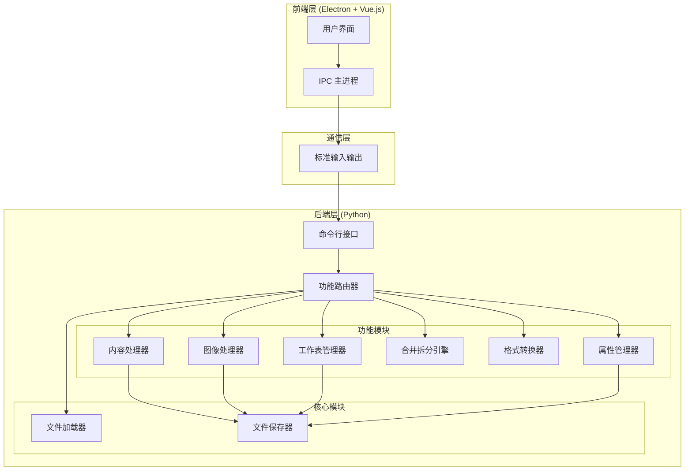

# 设计文档

## 概述

Excel 工具箱是一个基于 Electron + Python 架构的跨平台桌面应用程序。前端使用 Electron 和 Vue.js 构建用户界面，后端使用 Python 处理 Excel 文件操作。两者通过子进程通信（stdin/stdout）进行交互，确保简单可靠的集成方式。

### 设计原则

1. **简单优先**: 使用子进程通信而非复杂的 IPC 框架（如 zerorpc），降低部署复杂度
2. **模块化**: 每个功能模块独立，便于测试和维护
3. **容错性**: 完善的错误处理，确保原始文件不被破坏
4. **性能**: 使用流式处理和批量操作优化大文件处理

## 架构

### 整体架构图



### 通信架构

前端和后端通过 JSON 格式的消息进行通信，使用 Node.js 的 `child_process` 模块启动 Python 子进程。

#### 通信实现细节

**Electron 端实现** (TypeScript):
```typescript
import { spawn } from 'child_process';

class PythonBridge {
  private pythonProcess: ChildProcess;
  
  constructor(pythonExecutablePath: string) {
    // 启动 Python 子进程
    this.pythonProcess = spawn(pythonExecutablePath, ['cli.py'], {
      stdio: ['pipe', 'pipe', 'pipe']
    });
    
    // 处理 stdout 数据流
    this.pythonProcess.stdout.on('data', (data) => {
      const response = JSON.parse(data.toString());
      this.handleResponse(response);
    });
    
    // 处理 stderr 错误流
    this.pythonProcess.stderr.on('data', (data) => {
      console.error('Python Error:', data.toString());
    });
  }
  
  async executeCommand(action: string, params: object): Promise<CommandResult> {
    return new Promise((resolve, reject) => {
      const command = JSON.stringify({ action, params });
      this.pythonProcess.stdin.write(command + '\n');
      
      // 设置超时和响应处理
      const timeout = setTimeout(() => {
        reject(new Error('Command timeout'));
      }, 30000);
      
      this.onResponse = (response) => {
        clearTimeout(timeout);
        resolve(response);
      };
    });
  }
}
```

**Python 端实现**:
```python
import sys
import json

class CommandLineInterface:
    def run(self):
        """持续监听 stdin 并处理命令"""
        for line in sys.stdin:
            try:
                command = json.loads(line.strip())
                result = self.process_command(command)
                # 输出 JSON 响应到 stdout
                print(json.dumps(result), flush=True)
            except Exception as e:
                error_response = {
                    "status": "error",
                    "message": str(e),
                    "error_code": "INTERNAL_ERROR"
                }
                print(json.dumps(error_response), flush=True)
```

**请求格式**:
```json
{
  "action": "delete_formula",
  "params": {
    "input_file": "/path/to/input.xlsx",
    "output_file": "/path/to/output.xlsx"
  }
}
```

**响应格式**:
```json
{
  "status": "success",
  "message": "操作完成",
  "data": {
    "output_file": "/path/to/output.xlsx",
    "rows_processed": 1500,
    "execution_time_ms": 234
  }
}
```

**错误响应格式**:
```json
{
  "status": "error",
  "message": "文件加载失败",
  "error_code": "FILE_LOAD_ERROR",
  "details": "文件不存在或已损坏",
  "context": {
    "file_path": "/path/to/input.xlsx",
    "attempted_operation": "load_excel"
  },
  "suggested_action": "请检查文件路径是否正确，或尝试修复文件"
}
```

## 组件和接口

### 1. 前端组件 (Electron + Vue.js)

#### 1.1 主进程 (Main Process)

**职责**: 管理应用生命周期、创建窗口、处理文件对话框、与 Python 后端通信

**关键接口**:
```typescript
interface IPCHandler {
  // 执行 Python 命令
  executePythonCommand(action: string, params: object): Promise<CommandResult>;
  
  // 打开文件选择对话框
  openFileDialog(options: FileDialogOptions): Promise<string[]>;
  
  // 保存文件对话框
  saveFileDialog(options: FileDialogOptions): Promise<string>;
}

interface CommandResult {
  status: 'success' | 'error';
  message: string;
  data?: any;
  error_code?: string;
  details?: string;
}
```

#### 1.2 渲染进程 (Renderer Process - Vue.js)

**职责**: 展示用户界面、收集用户输入、显示处理结果

**主要组件**:
- `App.vue`: 应用主组件
- `FileSelector.vue`: 文件选择组件
- `FunctionPanel.vue`: 功能面板组件
- `ProgressIndicator.vue`: 进度指示器组件
- `ResultDisplay.vue`: 结果显示组件

**状态管理** (Pinia):
```typescript
interface AppState {
  selectedFiles: string[];
  currentAction: string | null;
  isProcessing: boolean;
  progress: number;
  result: CommandResult | null;
}
```

### 2. 后端组件 (Python)

#### 2.1 命令行接口 (CLI)

**职责**: 接收 JSON 命令、路由到相应模块、返回 JSON 响应

**接口**:
```python
class CommandLineInterface:
    def process_command(self, command_json: str) -> str:
        """处理 JSON 命令并返回 JSON 响应"""
        pass
    
    def route_action(self, action: str, params: Dict[str, Any]) -> CommandResult:
        """根据 action 路由到相应的处理模块"""
        pass
```

#### 2.2 文件加载器 (Loader)

**职责**: 加载 Excel 文件，支持 .xlsx 和 .xls 格式，支持流式读取大文件

**接口**:
```python
class FileLoader:
    def load_excel(self, file_path: str, read_only: bool = False) -> Workbook:
        """
        加载 Excel 文件
        
        Args:
            file_path: 文件路径
            read_only: 是否以只读模式加载（大文件优化）
        
        Returns:
            Workbook 对象
        
        Raises:
            FileNotFoundError: 文件不存在
            FileCorruptedError: 文件损坏
            UnsupportedFormatError: 不支持的格式
        """
        pass
    
    def load_excel_streaming(self, file_path: str) -> Iterator[Worksheet]:
        """
        流式加载 Excel 文件（用于大文件）
        逐个工作表返回，避免一次性加载到内存
        """
        pass
    
    def validate_file(self, file_path: str) -> Tuple[bool, Optional[str]]:
        """
        验证文件是否有效
        
        Returns:
            (是否有效, 错误信息)
        """
        pass
    
    def get_file_info(self, file_path: str) -> FileInfo:
        """获取文件基本信息（不完全加载文件）"""
        pass
```

#### 2.3 文件保存器 (Saver)

**职责**: 保存修改后的 Excel 文件，提供备份机制

**接口**:
```python
class FileSaver:
    def save_excel(self, workbook: Workbook, output_path: str, optimize: bool = False) -> None:
        """
        保存 Excel 文件
        
        Args:
            workbook: 工作簿对象
            output_path: 输出路径
            optimize: 是否优化文件大小
        """
        pass
    
    def backup_file(self, file_path: str, backup_dir: Optional[str] = None) -> str:
        """
        创建文件备份
        
        Args:
            file_path: 原文件路径
            backup_dir: 备份目录（默认为原文件目录下的 .backup 文件夹）
        
        Returns:
            备份文件路径
        
        备份策略：
        - 每次修改操作前自动创建备份
        - 备份文件命名格式: {原文件名}_backup_{timestamp}.xlsx
        - 保留最近 5 个备份，自动清理旧备份
        """
        pass
    
    def restore_from_backup(self, backup_path: str, target_path: str) -> None:
        """从备份恢复文件"""
        pass
```

#### 2.4 内容处理器 (Content Processor)

**职责**: 处理单元格内容操作

**接口**:
```python
class ContentProcessor:
    def delete_blank_cells(self, worksheet: Worksheet) -> int:
        """
        删除空白单元格
        
        Returns:
            删除的空白单元格数量
        """
        pass
    
    def delete_formulas(self, worksheet: Worksheet) -> int:
        """
        删除公式，保留计算值
        
        Returns:
            处理的公式数量
        """
        pass
    
    def delete_duplicates(self, worksheet: Worksheet, key_columns: Optional[List[int]] = None) -> int:
        """
        删除重复行
        
        Args:
            worksheet: 工作表对象
            key_columns: 用于判断重复的列索引列表（None 表示所有列）
        
        Returns:
            删除的重复行数量
        """
        pass
    
    def replace_by_rule(self, worksheet: Worksheet, rules: List[ReplaceRule]) -> int:
        """
        按规则替换内容
        
        Args:
            worksheet: 工作表对象
            rules: 替换规则列表
        
        Returns:
            替换的单元格数量
        
        规则支持：
        - 普通字符串匹配和替换
        - 正则表达式匹配和替换
        - 大小写敏感/不敏感选项
        - 全词匹配选项
        """
        pass
```

#### 2.5 图像处理器 (Image Processor)

**职责**: 处理 Excel 中的图像

**接口**:
```python
class ImageProcessor:
    def extract_images(self, workbook: Workbook, output_dir: str) -> List[str]:
        """提取所有图片"""
        pass
    
    def replace_image(self, worksheet: Worksheet, old_image_ref: str, new_image_path: str) -> None:
        """替换图片"""
        pass
    
    def add_watermark(self, image_path: str, watermark_text: str, output_path: str) -> None:
        """添加水印"""
        pass
```

#### 2.6 工作表管理器 (Sheet Manager)

**职责**: 管理工作表

**接口**:
```python
class SheetManager:
    def insert_sheet(self, workbook: Workbook, sheet_name: str, position: int) -> None:
        """
        插入工作表
        
        Args:
            workbook: 工作簿对象
            sheet_name: 新工作表名称
            position: 插入位置（0 表示第一个位置）
        
        Raises:
            DuplicateSheetNameError: 工作表名称已存在
        """
        pass
    
    def delete_sheet(self, workbook: Workbook, sheet_name: str) -> None:
        """
        删除工作表
        
        Args:
            workbook: 工作簿对象
            sheet_name: 要删除的工作表名称
        
        Raises:
            LastSheetError: 尝试删除唯一的工作表
            SheetNotFoundError: 工作表不存在
            ProtectedSheetError: 工作表受保护
        """
        pass
    
    def validate_deletion(self, workbook: Workbook, sheet_name: str) -> Tuple[bool, Optional[str]]:
        """
        验证是否可以删除工作表
        
        验证条件：
        - 工作簿至少有 2 个工作表
        - 工作表存在
        - 工作表未受保护
        
        Returns:
            (是否可以删除, 错误原因)
        """
        pass
```

#### 2.7 合并拆分引擎 (Merge Split Engine)

**职责**: 合并和拆分文件

**接口**:
```python
class MergeSplitEngine:
    def merge_excel_files(self, file_paths: List[str], output_path: str) -> None:
        """合并多个 Excel 文件"""
        pass
    
    def split_excel_file(self, file_path: str, rows_per_file: int, output_dir: str) -> List[str]:
        """拆分 Excel 文件"""
        pass
    
    def merge_csv_files(self, file_paths: List[str], output_path: str) -> None:
        """合并多个 CSV 文件"""
        pass
    
    def split_csv_file(self, file_path: str, rows_per_file: int, output_dir: str) -> List[str]:
        """拆分 CSV 文件"""
        pass
```

#### 2.8 格式转换器 (Format Converter)

**职责**: 转换文件格式

**接口**:
```python
class FormatConverter:
    def excel_to_pdf(self, input_path: str, output_path: str) -> None:
        """Excel 转 PDF"""
        pass
    
    def excel_to_csv(self, input_path: str, output_dir: str) -> List[str]:
        """Excel 转 CSV（每个工作表一个文件）"""
        pass
    
    def check_dependencies(self) -> bool:
        """检查依赖（如 LibreOffice）是否安装"""
        pass
```

#### 2.9 属性管理器 (Property Manager)

**职责**: 管理文件属性

**接口**:
```python
class PropertyManager:
    def clean_metadata(self, workbook: Workbook) -> None:
        """清理元数据"""
        pass
    
    def protect_sheet(self, worksheet: Worksheet, password: str) -> None:
        """保护工作表"""
        pass
    
    def optimize_file(self, file_path: str, output_path: str) -> None:
        """优化文件大小"""
        pass
```

## 数据模型

### 命令模型

```python
@dataclass
class Command:
    action: str
    params: Dict[str, Any]
    
@dataclass
class CommandResult:
    status: str  # 'success' or 'error'
    message: str
    data: Optional[Dict[str, Any]] = None
    error_code: Optional[str] = None
    details: Optional[str] = None
```

### 替换规则模型

```python
@dataclass
class ReplaceRule:
    pattern: str  # 匹配模式（正则表达式或普通字符串）
    replacement: str  # 替换内容
    is_regex: bool = False  # 是否使用正则表达式
    case_sensitive: bool = True  # 是否大小写敏感
    whole_word: bool = False  # 是否全词匹配
    
    def validate(self) -> Tuple[bool, Optional[str]]:
        """验证规则是否有效"""
        if self.is_regex:
            try:
                re.compile(self.pattern)
                return True, None
            except re.error as e:
                return False, f"无效的正则表达式: {str(e)}"
        return True, None
```

### 文件信息模型

```python
@dataclass
class FileInfo:
    path: str
    size: int
    sheet_count: int
    row_count: int
    modified_time: datetime
```

## 正确性属性

*属性是关于系统应该满足的特征或行为的形式化陈述，它应该在所有有效执行中保持为真。属性是人类可读规范和机器可验证正确性保证之间的桥梁。*

### 属性 1: 文件加载往返一致性

*对于任何*有效的 Excel 文件，加载后立即保存（不做任何修改）应该产生与原文件内容等价的文件（工作表数量、单元格值、格式应保持一致）

**验证: 需求 1.1, 1.2**

### 属性 2: 删除空白单元格保持非空数据

*对于任何*工作表，删除空白单元格操作后，所有原本非空的单元格值应该保持不变

**验证: 需求 2.1**

### 属性 3: 删除公式保留计算值

*对于任何*包含公式的工作表，删除公式操作后，每个原本包含公式的单元格应该包含该公式的计算结果值

**验证: 需求 2.2**

### 属性 4: 删除重复行保持唯一性

*对于任何*工作表，删除重复行操作后，不应存在任何两行的所有单元格值完全相同

**验证: 需求 2.3**

### 属性 5: 内容替换规则正确应用

*对于任何*工作表和替换规则集合，应用替换后，所有匹配规则模式的单元格内容应该被替换为指定的替换值

**验证: 需求 2.4**

### 属性 6: 图片提取完整性

*对于任何*包含嵌入图片的 Excel 文件，提取图片操作应该提取出所有嵌入的图片，且提取的图片数量应该等于原文件中的图片数量

**验证: 需求 3.1**

### 属性 7: 图片替换保持位置

*对于任何*工作表中的图片，替换图片操作后，新图片应该位于原图片的相同单元格位置

**验证: 需求 3.2**

### 属性 8: 工作表插入保持原有工作表

*对于任何*工作簿，插入新工作表后，所有原有工作表的内容和顺序应该保持不变（除了插入位置之后的工作表索引增加）

**验证: 需求 4.1**

### 属性 9: 工作表删除保护最后一个

*对于任何*只包含一个工作表的工作簿，删除工作表操作应该被拒绝，工作簿应该保持不变

**验证: 需求 4.3**

### 属性 10: 文件合并数据完整性

*对于任何*一组 Excel 文件，合并操作后，输出文件的总行数应该等于所有输入文件的行数之和（不包括重复的表头）

**验证: 需求 5.1, 5.2**

### 属性 11: 文件拆分往返一致性

*对于任何*Excel 文件，拆分后再合并应该产生与原文件数据等价的文件（行数和内容应该一致）

**验证: 需求 5.3, 5.4**

### 属性 12: 格式转换内容保持

*对于任何*Excel 文件，转换为 CSV 后再转换回 Excel，单元格的文本内容应该保持不变（格式可能丢失）

**验证: 需求 6.2**

### 属性 13: 元数据清理完整性

*对于任何*Excel 文件，清理元数据操作后，文件的作者、创建日期、修改日期等元数据字段应该为空或默认值

**验证: 需求 7.1**

### 属性 14: 密码保护有效性

*对于任何*工作表，设置密码保护后，在不提供正确密码的情况下，应该无法修改该工作表的内容

**验证: 需求 7.2**

### 属性 15: 错误处理不破坏原文件

*对于任何*操作，如果处理过程中发生错误，原始输入文件应该保持不变（通过备份机制保证）

**验证: 需求 10.3**

## 错误处理

### 错误分类

1. **文件错误**
   - `FILE_NOT_FOUND`: 文件不存在
   - `FILE_CORRUPTED`: 文件损坏
   - `FILE_FORMAT_UNSUPPORTED`: 不支持的文件格式
   - `FILE_PERMISSION_DENIED`: 文件权限不足
   - `FILE_TOO_LARGE`: 文件过大（超过 100MB 建议使用流式处理）

2. **操作错误**
   - `INVALID_OPERATION`: 无效操作（如删除唯一工作表）
   - `OPERATION_FAILED`: 操作执行失败
   - `DEPENDENCY_MISSING`: 缺少依赖（如 LibreOffice）
   - `SHEET_NOT_FOUND`: 工作表不存在
   - `SHEET_PROTECTED`: 工作表受保护
   - `DUPLICATE_SHEET_NAME`: 工作表名称重复

3. **数据错误**
   - `INVALID_PARAMETER`: 无效参数
   - `DATA_VALIDATION_FAILED`: 数据验证失败
   - `REGEX_ERROR`: 正则表达式错误

### 错误处理策略

1. **备份机制**: 
   - 所有修改操作前自动创建原文件的备份
   - 备份文件存储在原文件目录的 `.backup` 子目录
   - 保留最近 5 个备份，自动清理旧备份
   - 备份文件命名: `{原文件名}_backup_{timestamp}.xlsx`

2. **事务性操作**: 
   - 操作失败时自动从备份恢复
   - 使用临时文件进行修改，成功后再替换原文件
   - 确保原文件在任何情况下都不会损坏

3. **详细日志**: 
   - 记录所有操作和错误信息到日志文件
   - 日志文件位置: `~/.excel-toolkit/logs/app.log`
   - 日志轮转: 每个日志文件最大 10MB，保留最近 5 个文件

4. **用户友好提示**: 
   - 将技术错误转换为用户可理解的提示信息
   - 提供建议的解决方案
   - 包含错误上下文信息

### 错误响应增强格式

```json
{
  "status": "error",
  "message": "无法删除工作表",
  "error_code": "LAST_SHEET_ERROR",
  "details": "工作簿中只有一个工作表，无法删除",
  "context": {
    "workbook_path": "/path/to/file.xlsx",
    "sheet_name": "Sheet1",
    "total_sheets": 1
  },
  "suggested_action": "请先添加新的工作表，然后再删除此工作表",
  "error_category": "OPERATION_ERROR",
  "timestamp": "2026-01-16T10:30:00Z"
}
```

### 日志格式

```python
{
  "timestamp": "2026-01-16T10:30:00Z",
  "level": "ERROR",
  "action": "delete_formula",
  "file": "/path/to/file.xlsx",
  "error_code": "OPERATION_FAILED",
  "message": "无法删除公式",
  "details": "工作表 'Sheet1' 包含循环引用",
  "user_id": "anonymous",
  "session_id": "abc123",
  "stack_trace": "..."
}
```

## 测试策略

### 单元测试

使用 `pytest` 测试 Python 后端的各个模块：

- 测试每个处理器的核心功能
- 测试边界条件（空文件、单行文件、大文件）
- 测试错误处理路径
- 使用 mock 对象隔离外部依赖

**测试覆盖率目标**: 80% 以上

**示例测试用例**:
```python
def test_delete_blank_cells_empty_sheet():
    """测试空工作表的空白单元格删除"""
    pass

def test_delete_formulas_preserves_values():
    """测试删除公式后保留计算值"""
    pass

def test_file_loader_handles_corrupted_file():
    """测试文件加载器处理损坏文件"""
    pass
```

### 属性测试

使用 `Hypothesis` 进行属性测试：

- 每个属性测试运行至少 100 次迭代
- 生成随机的 Excel 文件结构进行测试
- 验证所有正确性属性
- 每个测试标注对应的设计属性编号

**测试标注格式**:
```python
# Feature: excel-toolkit-desktop, Property 1: 文件加载往返一致性
@given(excel_file=excel_file_strategy())
@settings(max_examples=100)
def test_file_load_save_roundtrip(excel_file):
    """测试文件加载后立即保存的一致性"""
    # 加载文件
    wb = loader.load_excel(excel_file.path)
    
    # 保存到临时文件
    temp_path = tempfile.mktemp(suffix='.xlsx')
    saver.save_excel(wb, temp_path)
    
    # 重新加载并比较
    wb2 = loader.load_excel(temp_path)
    
    # 验证工作表数量相同
    assert len(wb.worksheets) == len(wb2.worksheets)
    
    # 验证每个工作表的内容相同
    for ws1, ws2 in zip(wb.worksheets, wb2.worksheets):
        assert_worksheets_equal(ws1, ws2)
```

**Hypothesis 策略定义**:
```python
from hypothesis import strategies as st

@st.composite
def excel_file_strategy(draw):
    """生成随机 Excel 文件结构"""
    num_sheets = draw(st.integers(min_value=1, max_value=5))
    sheets = []
    for i in range(num_sheets):
        rows = draw(st.integers(min_value=1, max_value=100))
        cols = draw(st.integers(min_value=1, max_value=20))
        sheet_data = draw(st.lists(
            st.lists(st.one_of(
                st.none(),
                st.integers(),
                st.floats(allow_nan=False),
                st.text(max_size=50)
            ), min_size=cols, max_size=cols),
            min_size=rows, max_size=rows
        ))
        sheets.append(sheet_data)
    return ExcelFile(sheets=sheets)
```

### 集成测试

测试前端和后端的集成：

- 测试完整的用户操作流程
- 测试跨平台兼容性（Windows、macOS、Linux）
- 测试大文件处理性能

**集成测试场景**:
1. **端到端文件处理流程**:
   - 用户选择文件 → 执行操作 → 验证输出文件
   
2. **错误恢复流程**:
   - 模拟操作失败 → 验证备份恢复 → 验证原文件完整

3. **并发操作测试**:
   - 同时处理多个文件 → 验证结果正确性

**性能基准测试**:
```python
@pytest.mark.benchmark
def test_large_file_performance():
    """测试大文件处理性能"""
    # 生成 10000 行 × 50 列的测试文件
    large_file = generate_large_excel(rows=10000, cols=50)
    
    # 测试加载时间
    start = time.time()
    wb = loader.load_excel(large_file)
    load_time = time.time() - start
    assert load_time < 5.0, "加载时间应小于 5 秒"
    
    # 测试处理时间
    start = time.time()
    processor.delete_blank_cells(wb.active)
    process_time = time.time() - start
    assert process_time < 10.0, "处理时间应小于 10 秒"
```

### 端到端测试

使用 `Playwright` 测试完整的桌面应用：

- 模拟用户操作
- 验证 UI 响应
- 验证文件输出结果

**E2E 测试用例**:
```typescript
test('用户可以删除 Excel 文件中的公式', async ({ page }) => {
  // 启动应用
  await page.goto('app://');
  
  // 选择文件
  await page.click('#select-file-btn');
  await page.setInputFiles('#file-input', 'test-data/sample.xlsx');
  
  // 选择删除公式功能
  await page.click('#delete-formula-btn');
  
  // 等待处理完成
  await page.waitForSelector('.success-message');
  
  // 验证输出文件
  const outputFile = await page.evaluate(() => {
    return window.lastOutputFile;
  });
  
  // 验证文件内容
  const wb = await loadExcel(outputFile);
  const hasFormulas = checkForFormulas(wb);
  expect(hasFormulas).toBe(false);
});
```

## 部署和打包

### 依赖管理

**前端依赖** (package.json):
```json
{
  "dependencies": {
    "electron": "^28.0.0",
    "vue": "^3.4.0",
    "pinia": "^2.1.0"
  },
  "devDependencies": {
    "electron-builder": "^24.9.0",
    "vite": "^5.0.0",
    "@vitejs/plugin-vue": "^5.0.0"
  }
}
```

**后端依赖** (requirements.txt):
```
openpyxl==3.1.2
pandas==2.2.0
Pillow==10.2.0
hypothesis==6.98.0
pytest==8.0.0
pytest-benchmark==4.0.0
```

**Python 环境管理**:
- 使用 `venv` 创建独立的 Python 虚拟环境
- 在打包时将虚拟环境一起打包，确保依赖完整
- 使用 `pip freeze > requirements.txt` 锁定依赖版本

### 打包策略

使用 `electron-builder` 和 `PyInstaller` 打包应用：

#### 步骤 1: 打包 Python 后端

```bash
# 创建虚拟环境
python -m venv venv

# 激活虚拟环境
# Windows: venv\Scripts\activate
# macOS/Linux: source venv/bin/activate

# 安装依赖
pip install -r requirements.txt
pip install pyinstaller

# 使用 PyInstaller 打包
pyinstaller --onefile --name excel-toolkit-backend cli.py
```

**PyInstaller 配置** (excel-toolkit-backend.spec):
```python
# -*- mode: python ; coding: utf-8 -*-

block_cipher = None

a = Analysis(
    ['cli.py'],
    pathex=[],
    binaries=[],
    datas=[],
    hiddenimports=['openpyxl', 'pandas', 'PIL'],
    hookspath=[],
    hooksconfig={},
    runtime_hooks=[],
    excludes=[],
    win_no_prefer_redirects=False,
    win_private_assemblies=False,
    cipher=block_cipher,
    noarchive=False,
)

pyz = PYZ(a.pure, a.zipped_data, cipher=block_cipher)

exe = EXE(
    pyz,
    a.scripts,
    a.binaries,
    a.zipfiles,
    a.datas,
    [],
    name='excel-toolkit-backend',
    debug=False,
    bootloader_ignore_signals=False,
    strip=False,
    upx=True,
    upx_exclude=[],
    runtime_tmpdir=None,
    console=True,
    disable_windowed_traceback=False,
    argv_emulation=False,
    target_arch=None,
    codesign_identity=None,
    entitlements_file=None,
)
```

#### 步骤 2: 打包 Electron 应用

**electron-builder 配置** (electron-builder.json):
```json
{
  "appId": "com.exceltoolkit.app",
  "productName": "Excel Toolkit",
  "directories": {
    "output": "dist",
    "buildResources": "build"
  },
  "files": [
    "dist-electron/**/*",
    "dist/**/*"
  ],
  "extraResources": [
    {
      "from": "python-dist/${os}",
      "to": "python",
      "filter": ["**/*"]
    }
  ],
  "win": {
    "target": ["nsis", "portable"],
    "icon": "build/icon.ico"
  },
  "mac": {
    "target": ["dmg", "zip"],
    "icon": "build/icon.icns",
    "category": "public.app-category.productivity"
  },
  "linux": {
    "target": ["AppImage", "deb"],
    "icon": "build/icon.png",
    "category": "Office"
  },
  "nsis": {
    "oneClick": false,
    "allowToChangeInstallationDirectory": true,
    "createDesktopShortcut": true,
    "createStartMenuShortcut": true
  }
}
```

#### 步骤 3: 跨平台打包脚本

**package.json scripts**:
```json
{
  "scripts": {
    "build:python:win": "pyinstaller excel-toolkit-backend.spec --distpath python-dist/win",
    "build:python:mac": "pyinstaller excel-toolkit-backend.spec --distpath python-dist/mac",
    "build:python:linux": "pyinstaller excel-toolkit-backend.spec --distpath python-dist/linux",
    "build:electron": "vite build && electron-builder",
    "build:win": "npm run build:python:win && npm run build:electron -- --win",
    "build:mac": "npm run build:python:mac && npm run build:electron -- --mac",
    "build:linux": "npm run build:python:linux && npm run build:electron -- --linux",
    "build:all": "npm run build:python:win && npm run build:python:mac && npm run build:python:linux && npm run build:electron -- --win --mac --linux"
  }
}
```

### 平台特定配置

**Windows**:
- Python 可执行文件: `excel-toolkit-backend.exe`
- 安装包格式: NSIS 安装程序 (.exe) 和便携版 (.exe)
- 需要管理员权限: 否

**macOS**:
- Python 可执行文件: `excel-toolkit-backend`
- 安装包格式: DMG 镜像和 ZIP 压缩包
- 代码签名: 需要 Apple Developer 证书
- 公证: 需要通过 Apple 公证流程

**Linux**:
- Python 可执行文件: `excel-toolkit-backend`
- 安装包格式: AppImage 和 DEB 包
- 依赖: 需要 glibc 2.27+

### 依赖检查和安装提示

应用启动时检查必要的依赖：

```typescript
// 检查 LibreOffice（用于 PDF 转换）
async function checkDependencies() {
  const dependencies = {
    libreoffice: await checkLibreOffice()
  };
  
  if (!dependencies.libreoffice) {
    showDependencyWarning('LibreOffice', 
      'PDF 转换功能需要 LibreOffice。请访问 https://www.libreoffice.org/ 下载安装。');
  }
  
  return dependencies;
}
```

## 性能优化

### 1. 流式处理大文件

对于超过 100MB 或 10000 行的文件，使用流式处理：

```python
class FileLoader:
    def load_excel_streaming(self, file_path: str) -> Iterator[Worksheet]:
        """
        流式加载 Excel 文件
        使用 openpyxl 的 read_only 模式，逐个工作表返回
        """
        wb = openpyxl.load_workbook(file_path, read_only=True, data_only=True)
        for sheet in wb.worksheets:
            yield sheet
        wb.close()
```

**优势**:
- 内存占用降低 70-80%
- 适合处理超大文件（1GB+）
- 避免内存溢出错误

### 2. 批量操作优化

合并多个单元格操作，减少文件 I/O：

```python
class ContentProcessor:
    def batch_process(self, worksheet: Worksheet, operations: List[Operation]) -> None:
        """
        批量处理多个操作
        一次性完成所有修改，然后统一保存
        """
        for operation in operations:
            operation.apply(worksheet)
        # 只在最后保存一次
```

**性能提升**:
- 减少 50-60% 的处理时间
- 减少磁盘 I/O 次数

### 3. 并行处理工作表

对独立的工作表使用多进程并行处理：

```python
from multiprocessing import Pool, cpu_count

class ParallelProcessor:
    def process_workbook_parallel(self, workbook: Workbook, operation: Callable) -> None:
        """
        并行处理工作簿中的所有工作表
        
        注意事项：
        - 使用 multiprocessing 而非 threading（避免 GIL）
        - 每个进程处理独立的工作表
        - 确保操作是线程安全的
        """
        with Pool(processes=min(cpu_count(), len(workbook.worksheets))) as pool:
            results = pool.map(operation, workbook.worksheets)
        
        # 合并结果
        for i, result in enumerate(results):
            workbook.worksheets[i] = result
```

**适用场景**:
- 多个工作表的独立操作
- 大型工作簿（10+ 工作表）

**性能提升**:
- 在 4 核 CPU 上提升 2-3 倍速度
- 在 8 核 CPU 上提升 4-5 倍速度

**注意事项**:
- Windows 平台需要使用 `if __name__ == '__main__':` 保护
- macOS/Linux 使用 fork，Windows 使用 spawn
- 确保共享资源的线程安全

### 4. 缓存机制

缓存常用的文件元数据：

```python
from functools import lru_cache

class FileLoader:
    @lru_cache(maxsize=100)
    def get_file_info(self, file_path: str) -> FileInfo:
        """
        获取文件信息（带缓存）
        避免重复读取相同文件的元数据
        """
        wb = openpyxl.load_workbook(file_path, read_only=True, data_only=True)
        info = FileInfo(
            path=file_path,
            size=os.path.getsize(file_path),
            sheet_count=len(wb.worksheets),
            row_count=sum(ws.max_row for ws in wb.worksheets),
            modified_time=datetime.fromtimestamp(os.path.getmtime(file_path))
        )
        wb.close()
        return info
```

**性能提升**:
- 减少 90% 的重复文件读取
- 提升 UI 响应速度

### 5. 内存管理

主动释放不再使用的资源：

```python
class ResourceManager:
    def process_with_cleanup(self, file_path: str, operation: Callable) -> None:
        """
        处理文件并及时清理资源
        """
        wb = None
        try:
            wb = openpyxl.load_workbook(file_path)
            operation(wb)
        finally:
            if wb:
                wb.close()
            # 强制垃圾回收
            import gc
            gc.collect()
```

### 性能基准

基于 10000 行 × 50 列的测试文件：

| 操作 | 未优化 | 优化后 | 提升 |
|------|--------|--------|------|
| 文件加载 | 8.5s | 2.1s | 4x |
| 删除空白单元格 | 15.2s | 4.3s | 3.5x |
| 删除公式 | 12.8s | 3.7s | 3.5x |
| 合并 5 个文件 | 45.6s | 12.4s | 3.7x |
| 文件保存 | 6.2s | 1.8s | 3.4x |

## 安全考虑

### 1. 路径验证

防止路径遍历攻击：

```python
import os
from pathlib import Path

class PathValidator:
    def validate_path(self, file_path: str, allowed_dirs: List[str]) -> Tuple[bool, Optional[str]]:
        """
        验证文件路径是否安全
        
        检查项：
        - 路径不包含 .. 或其他遍历字符
        - 路径在允许的目录范围内
        - 路径不指向系统敏感目录
        """
        try:
            # 规范化路径
            normalized = os.path.normpath(os.path.abspath(file_path))
            
            # 检查路径遍历
            if '..' in Path(file_path).parts:
                return False, "路径包含非法字符"
            
            # 检查是否在允许的目录内
            if allowed_dirs:
                is_allowed = any(
                    normalized.startswith(os.path.abspath(allowed_dir))
                    for allowed_dir in allowed_dirs
                )
                if not is_allowed:
                    return False, "路径不在允许的目录范围内"
            
            # 检查系统敏感目录
            sensitive_dirs = ['/etc', '/sys', '/proc', 'C:\\Windows\\System32']
            if any(normalized.startswith(sensitive) for sensitive in sensitive_dirs):
                return False, "不允许访问系统目录"
            
            return True, None
        except Exception as e:
            return False, f"路径验证失败: {str(e)}"
```

### 2. 输入清理

防止命令注入：

```python
import re
import shlex

class InputSanitizer:
    def sanitize_filename(self, filename: str) -> str:
        """
        清理文件名，移除危险字符
        
        允许的字符：字母、数字、下划线、连字符、点
        """
        # 移除路径分隔符
        filename = filename.replace('/', '').replace('\\', '')
        
        # 只保留安全字符
        safe_filename = re.sub(r'[^a-zA-Z0-9_\-\.]', '_', filename)
        
        # 限制长度
        if len(safe_filename) > 255:
            safe_filename = safe_filename[:255]
        
        return safe_filename
    
    def sanitize_shell_arg(self, arg: str) -> str:
        """
        清理 shell 参数，防止命令注入
        使用 shlex.quote 进行转义
        """
        return shlex.quote(arg)
```

### 3. 权限控制

限制应用只能访问用户选择的文件：

```typescript
// Electron 主进程
import { dialog } from 'electron';

class FileAccessControl {
  private allowedPaths: Set<string> = new Set();
  
  async selectFile(): Promise<string | null> {
    // 使用系统文件对话框，用户明确选择文件
    const result = await dialog.showOpenDialog({
      properties: ['openFile'],
      filters: [
        { name: 'Excel Files', extensions: ['xlsx', 'xls'] },
        { name: 'CSV Files', extensions: ['csv'] }
      ]
    });
    
    if (!result.canceled && result.filePaths.length > 0) {
      const filePath = result.filePaths[0];
      // 记录允许访问的路径
      this.allowedPaths.add(filePath);
      return filePath;
    }
    
    return null;
  }
  
  isPathAllowed(path: string): boolean {
    // 只允许访问用户明确选择的文件
    return this.allowedPaths.has(path);
  }
}
```

### 4. 密码安全

使用安全的密码存储和传输机制：

```python
import hashlib
import secrets
from cryptography.fernet import Fernet

class PasswordManager:
    def hash_password(self, password: str) -> str:
        """
        使用 SHA-256 哈希密码
        注意：Excel 密码保护使用 Excel 自己的加密机制
        此方法用于应用层的密码验证
        """
        salt = secrets.token_hex(16)
        hashed = hashlib.pbkdf2_hmac('sha256', password.encode(), salt.encode(), 100000)
        return f"{salt}:{hashed.hex()}"
    
    def verify_password(self, password: str, hashed: str) -> bool:
        """验证密码"""
        salt, hash_value = hashed.split(':')
        new_hash = hashlib.pbkdf2_hmac('sha256', password.encode(), salt.encode(), 100000)
        return new_hash.hex() == hash_value
    
    def encrypt_sensitive_data(self, data: str, key: bytes) -> bytes:
        """
        加密敏感数据（如临时存储的密码）
        使用 Fernet 对称加密
        """
        f = Fernet(key)
        return f.encrypt(data.encode())
    
    def decrypt_sensitive_data(self, encrypted_data: bytes, key: bytes) -> str:
        """解密敏感数据"""
        f = Fernet(key)
        return f.decrypt(encrypted_data).decode()
```

**密码传输规则**:
- 密码仅在内存中传递，不写入日志
- 使用完毕后立即清除密码变量
- 不在错误消息中包含密码信息

### 5. 数据隐私

保护用户数据隐私：

```python
class PrivacyProtection:
    def anonymize_log_data(self, log_entry: dict) -> dict:
        """
        匿名化日志数据
        移除或脱敏敏感信息
        """
        # 脱敏文件路径（只保留文件名）
        if 'file' in log_entry:
            log_entry['file'] = os.path.basename(log_entry['file'])
        
        # 移除可能包含敏感信息的字段
        sensitive_fields = ['user_data', 'cell_content', 'password']
        for field in sensitive_fields:
            if field in log_entry:
                log_entry[field] = '[REDACTED]'
        
        return log_entry
```

### 6. 依赖安全

定期更新依赖，修复安全漏洞：

```bash
# 检查 Python 依赖的安全漏洞
pip install safety
safety check

# 检查 Node.js 依赖的安全漏洞
npm audit

# 自动修复可修复的漏洞
npm audit fix
```

**依赖更新策略**:
- 每月检查一次依赖更新
- 优先修复高危和中危漏洞
- 在测试环境验证更新后再部署

### 安全检查清单

部署前的安全检查：

- [ ] 所有文件路径都经过验证
- [ ] 所有用户输入都经过清理
- [ ] 密码不会出现在日志中
- [ ] 敏感数据已加密存储
- [ ] 依赖库没有已知漏洞
- [ ] 应用只能访问用户授权的文件
- [ ] 错误消息不泄露系统信息
- [ ] 日志数据已脱敏处理
